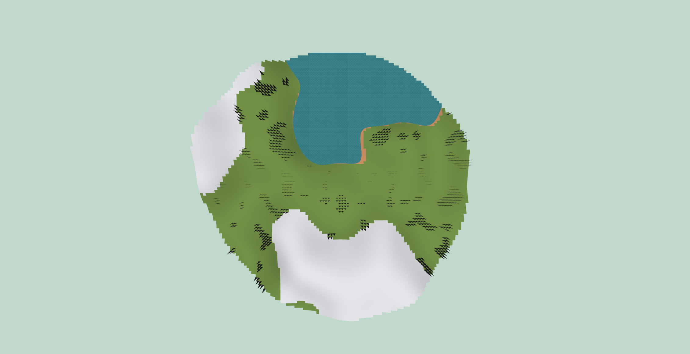
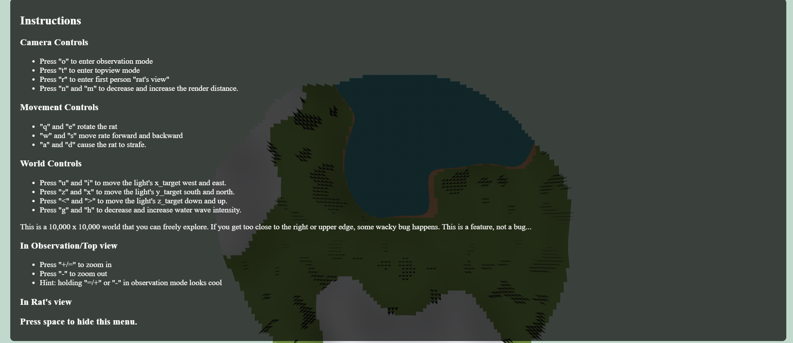
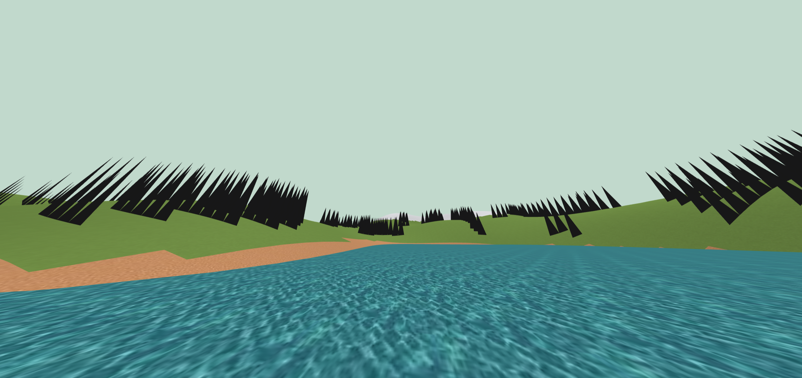

# Terrain Generator

This is a terrain generator created as part of Graphics Programming (CS-3600).

It features terrain generation using perlin noise. Included are textures, elevation, some basic water, and basic trees.
It also features a series of views and movement controls to enhance the experience and encourage exploration. See attached images for instructions and previews of the generator.

### Top View

### Instructions

### First Person View
